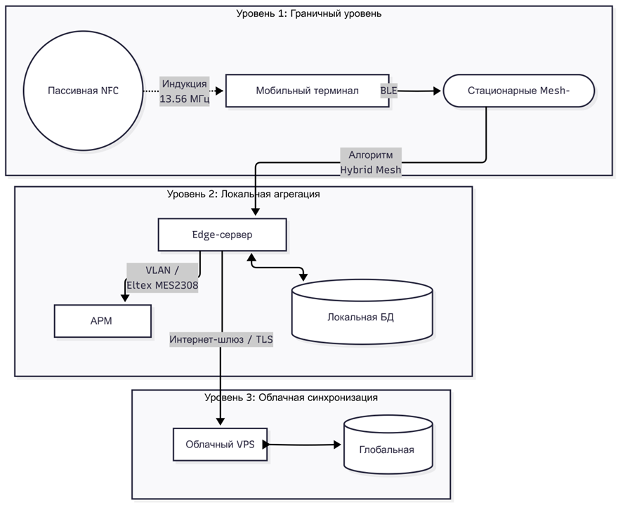
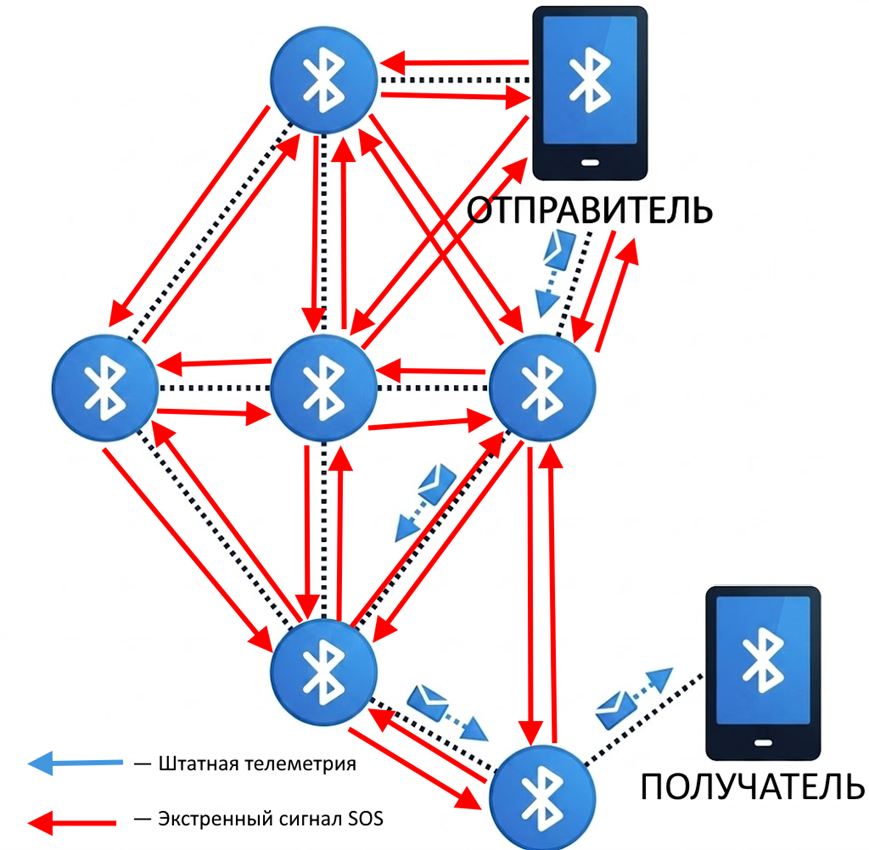

  <h1>🚨 АИС «Маячок» (Mayachok IoT)</h1>
  
<b>Отказоустойчивая B2G-платформа мониторинга персонала и маршрутизации экстренных сигналов</b>

  
  
  
  
  

> 🔒 **ОТКАЗ ОТ ОТВЕТСТВЕННОСТИ (NDA)**
> Данный репозиторий является **Showcase-презентацией (Case Study)** технической архитектуры и программных решений проекта, разработанного для Государственного казенного учреждения (ГКУ СРЦН). В целях соблюдения соглашения о неразглашении (NDA) и обеспечения безопасности критической информационной инфраструктуры (КИИ), **исходный код клиентских Android-терминалов, прошивки контроллеров и структура БД в открытый доступ не публикуются**. 

---

## 📖 1. Контекст и бизнес-проблематика

Работа социально-реабилитационных центров сопряжена с высокой психологической нагрузкой на персонал и строгими требованиями к безопасности подопечных. До внедрения АИС «Маячок» контроль рабочего процесса сталкивался с рядом архитектурных и процессных проблем:

1. **Архитектурные радиоблокировки:** Здание 1980-х годов постройки с толстыми железобетонными стенами (от 16 см) работает как «клетка Фарадея». Внутри невозможно использовать GNSS (спутниковые системы), а покрытие Wi-Fi нестабильно из-за эффекта многолучевого распространения.
2. **Уязвимость оптических маркеров:** Использование бумажных журналов или простых QR-кодов позволяло недобросовестным сотрудникам инициировать рабочие сессии удаленно (Replay Attack). 
3. **Безопасность в "слепых зонах":** В случае нештатной ситуации у педагога, находящегося в акустически изолированном помещении без сотовой связи, не было инструмента для гарантированной отправки сигнала SOS.

### 💡 Концептуальное решение
Система «Маячок» превращает личный Android-смартфон сотрудника в интеллектуальный IoT-шлюз (Mobile Edge Node), который взаимодействует с физической средой учреждения через интерфейсы ближнего поля (NFC/RFID) и децентрализованные ячеистые сети (BLE Mesh), обеспечивая 100% достоверность телеметрии.

---

## 🏗 2. Макро-архитектура (Hardware & Infrastructure)

Инфокоммуникационная система построена по трехуровневой архитектуре с использованием парадигмы **Edge Computing** (граничных вычислений) и концепции **Store-and-Forward**.

*(Иллюстрация: Структурная схема организации связи аппаратно-программного комплекса)*

*   **1. Аппаратная валидация (Proof-of-Presence):** Инициализация занятия возможна только при физическом касании смартфоном пассивной криптографической NFC-метки (ISO/IEC 14443, 13.56 МГц). Процесс защищен протоколом Challenge-Response с симметричным шифрованием AES-128 внутри защищенного сопроцессора метки (Secure Element).
*   **2. Hybrid BLE Mesh:** Внутри здания развернута сеть стационарных ретрансляторов. Штатная телеметрия передается по энергоэффективному алгоритму *Directed Forwarding*. Экстренные сигналы (SOS) автоматически перестраивают сеть на алгоритм *Managed Flooding* (лавинное распространение).

*(Иллюстрация: Схема маршрутизации в адаптивной гибридной топологии)*

*   **3. Локальная агрегация (Edge Server):** Данные аккумулируются на локальном микросервере в изолированном VLAN. При обрыве связи с провайдером сервер буферизует транзакции, гарантируя бесшовную репликацию в облако после восстановления линка.

---

## 💻 3. Архитектура Android-клиента (Software Deep Dive)

Клиентское приложение разработано в строгом соответствии с принципами **Modern Android Development (MAD)**.

### Технологический стек
*   **Language:** Kotlin 1.9+
*   **UI Framework:** Jetpack Compose (Material Design 3).
*   **Architecture:** MVVM + Unidirectional Data Flow (UDF).
*   **Dependency Injection:** Dagger Hilt.
*   **Concurrency:** Kotlin Coroutines & Flow (`StateFlow`, `SharedFlow`).
*   **Network:** Retrofit2, OkHttp3, Server-Sent Events (SSE).
*   **Local Storage:** `EncryptedSharedPreferences` (AES256_GCM / AES256_SIV).
*   **Hardware APIs:** `NfcAdapter`, `CameraX`, `Google ML Kit`, `VibratorManager`, `BiometricPrompt`.

---

## ⚙️ 4. Прикладные инженерные решения (Under the Hood)

### 4.1. Zero-Click Start (Системный перехват NFC)
Для повышения UX и скорости реакции в экстренной ситуации приложение не требуется открывать вручную. 
*   **Решение:** На уровне `AndroidManifest.xml` реализован `intent-filter` для перехвата `ACTION_NDEF_DISCOVERED` со специфичной схемой (`mayachok://class`). 
*   **Результат:** Прикладывание заблокированного смартфона к двери мгновенно поднимает `MainActivity`, извлекает payload (ID кабинета) и через Jetpack Navigation маршрутизирует пользователя на экран старта сессии, минуя главное меню.

### 4.2. Reactive State Management (Single Source of Truth)
Ввиду сложной ролевой модели (Директор, Педагог, Dev) и множества асинхронных событий, был отвергнут подход с разрозненными LiveData.
*   **Решение:** Внедрен `SharedViewModel` (инжектируемый через Hilt), содержащий исключительно `StateFlow`. Вычисление сложной логики (например, комбинированная фильтрация отчетов) выполняется реактивно под капотом через оператор `combine`, возвращая в UI уже готовый иммутабельный стейт.

### 4.3. Концепция органических интерфейсов: Slime_Design
Для снижения когнитивной нагрузки и стресса у персонала была разработана и внедрена авторская система микроинтеракций и моушн-дизайна — **Slime_Design**, имитирующая физические свойства упругих жидкостей.
*   **Slime Bottom Bar:** Вместо классического перемещения ползунка между вкладками бара, реализована сложная векторная анимация. Индикатор растягивается по ширине экрана, образуя «хвост», а затем упруго стягивается к целевой вкладке.
*   **SlimeSwitch:** Стандартные Android-переключатели переписаны на низкоуровневых компонентах Compose. Применена физика пружины (`spring` с `dampingRatio = 0.6f` и `stiffness = 250f`). 
*   **Техническая реализация:** Вся физика написана исключительно на `animateFloatAsState` и `animateDpAsState` с аппаратным ускорением графики, без использования сторонних тяжелых библиотек.

### 4.4. Резервное зрение (CameraX + ML Kit Fallback)
На случай физического вандализма и повреждения NFC-меток, в приложение интегрирован резервный оптический сканер QR-кодов. Использован `ProcessCameraProvider` с привязкой к Lifecycle Compose-компонента и стратегией `STRATEGY_KEEP_ONLY_LATEST` для предотвращения утечек памяти. Внедрена жесткая Debounce-логика для блокировки повторных кадров после успешного распознавания.

### 4.5. Real-Time мониторинг и Background-процессы
Система требует мгновенной реакции на сигналы SOS и изменения статусов (модуль «Радар»).
*   **Решение (Сеть):** Интеграция Server-Sent Events (SSE) через `OkHttp EventSourceListener`. Приложение держит легковесное TCP-соединение, асинхронно реагируя на пуши от базы данных.
*   **Решение (Фон):** Для гарантированной доставки SOS-пакетов реализован `Foreground Service` (тип `dataSync`). Служба удерживает процессор через `PowerManager.PARTIAL_WAKE_LOCK`, не позволяя системе убить процесс сканирования эфира.

### 4.6. Нативный движок генерации PDF
Разработан класс `PdfExporter`, динамически инжектирующий переменные в предкомпилированные HTML-шаблоны. Сформированный HTML рендерится в невидимом `WebView` в Main-потоке, после чего передается в нативный Android `PrintManager` (PrintAttributes.MediaSize.ISO_A4). Это позволило отказаться от тяжеловесных сторонних библиотек.

---

## 🛡 5. Информационная безопасность и Privacy

Система обрабатывает персональные данные и координаты сотрудников, поэтому безопасность внедрена на всех слоях (Secure by Design):

1. **Биометрия:** Экран входа (`LoginScreen`) поддерживает беспарольную аутентификацию через `BiometricPrompt` (FaceID / Fingerprint) с резервным PIN-кодом.
2. **Encrypted Storage:** JWT-токены, роли и кэшированные данные шифруются библиотекой `androidx.security.crypto` с использованием `MasterKey` (AES256_GCM).
3. **Гранулярное согласие (152-ФЗ):** Приложение содержит модуль Granular Consent, требующий явного опти-на (Opt-in) на сбор геолокационных меток.
4. **Network Interceptor:** Токены авторизации инжектируются в HTTP-заголовки динамически через Dagger Hilt `TokenInterceptor`, исключая их хардкод в запросах.

---

## 🚀 6. Технические вызовы (Challenges Overcome)
*   **Борьба с Doze Mode в Android:** Потребовалась глубокая настройка Foreground Service и агрессивных WakeLocks, чтобы операционная система не переводила радиотракт смартфона в спящий режим и не блокировала прием BLE-бродкастов.
*   **Оптимизация Compose:** Сложная математика анимаций Slime_Design приводила к лишним рекомпозициям. Проблема решена строгим использованием `remember` для стейтов и выносом тяжелых вычислений векторов за пределы фазы отрисовки (Draw Phase).

## 📈 7. Business Impact (Результаты внедрения)
*   **Время реакции на ЧС:** Снижено до **1.9 секунд** (гарантированная доставка SOS из любой точки здания).
*   **Автономность сети:** Расчетное время работы стационарных ретрансляторов без замены элементов питания составило **2.4 года**.
*   **Оптимизация процессов:** Автоматическая генерация PDF-журналов и прозрачная система KPI полностью исключили бумажную рутину и субъективный фактор при начислении выплат.

---

  <b>АИС «Маячок»</b> — это пример того, как передовые инженерные практики мобильной разработки объединяются с эмпатичным дизайном для защиты жизней и упрощения работы социальных служб.  
  <i>Архитектор и разработчик: H4leron (2026)</i>

